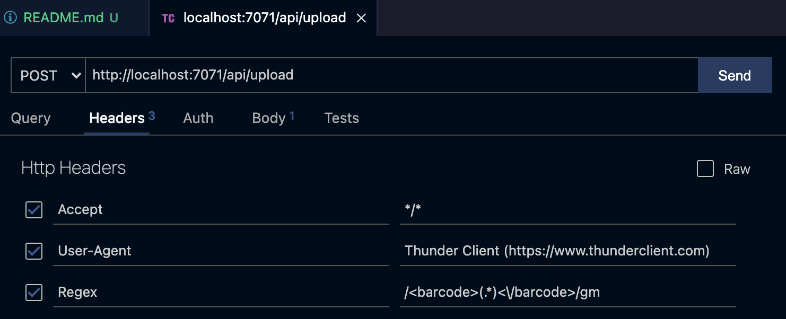
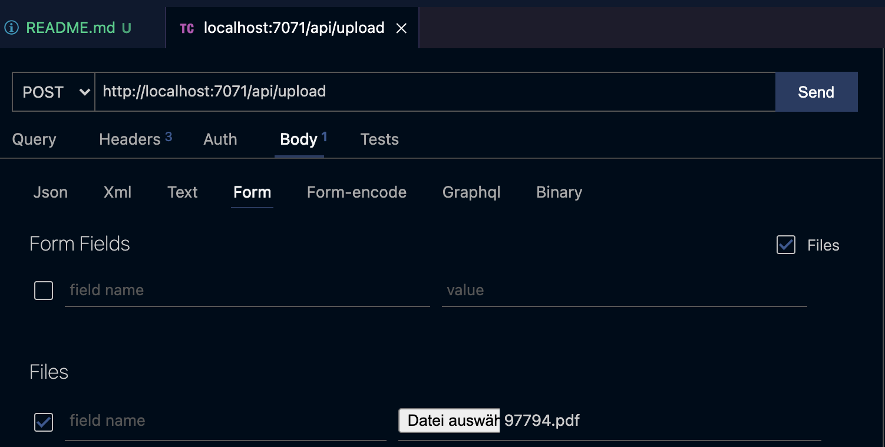
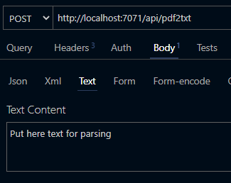

# Send a PDF or text to azure function /pdf2txt and get the structured json text back. 

For Regex use allways groups:

Example: 
```regexp
/\[(?<datetime>\d{1,2}.\d{1,2}.[ ,]*\d{2}:\d{2})\] (?<phone>\+[0-9 ]{1,20}): [\w :-_]*(?<url>https:\/{2}www.linkedin.com\/[a-zA-Z0-9:\/\-_]*)[\w ]*/gm
````

### Add Regex in Headers
</br>



-----  

</br>

> ## Note: Only PDF or text is possible, not both.

</br>

-----  


### Variant 1
#### Add PDF to Body Forms or


------

### Variant 2
#### Add text to Body


